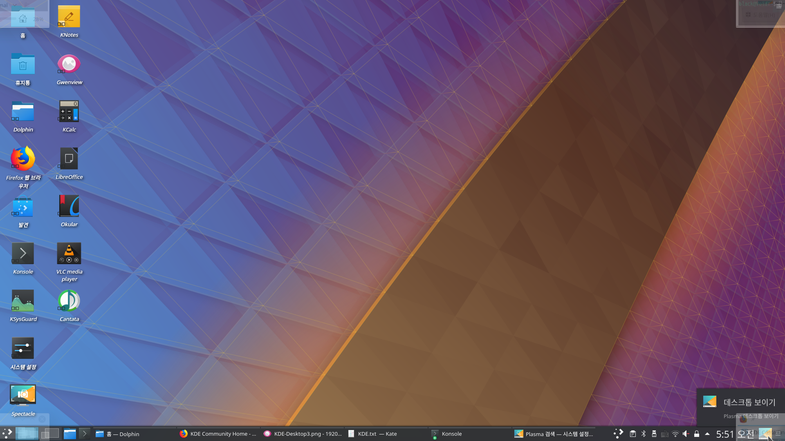

<!-- markdown-toc start - Don't edit this section. Run M-x markdown-toc-refresh-toc -->
**Table of Contents**

- [Plasma UX](#plasma-ux)
    - [Apply](#apply)
    - [Features](#features)
        - [Panel Icons.](#panel-icons)
        - [Active Screen Corners and Edge](#active-screen-corners-and-edge)
        - [Application Improved](#application-improved)

<!-- markdown-toc end -->

# Plasma UX

This files are [KDE Plasma](https://www.kde.org/plasma-desktop)'s improved setting.

based on Kubuntu 18.04.

* Original

[Original Image from [MT Software's Youtube](https://youtu.be/oxHz1kp4JmY?t=724)]

* Plasma UX Preview

## Apply

1. Download files

    `git clone https://github.com/black7375/plasma-ux.git`

2. Copy & Paste

    `cp -rfv config/* ~/.config && cp -rfv local/* ~/.local`

Now Apply!!

## Features

### Panel Icons.

1. Add Virtual Desktop(Original is one) && Icons.
2. Some Application Icon.
3. Program Dashboard.
4. Show Desktop.

* Program Dashboard.

* Show Desktop.

### Active Screen Corners and Edge

1. Left Top: Show all program's windows.
2. Right Top: Show this program's windows.
3. Left Bottom: Command Run(like Spotlight)
4. Right Bottom: Show Virtual Desktop.

* Show All Program.

* Show This Program.

* Command Run(Plasma Search)

  * Search Program, Files, Directory, Windows, Program Session, Bookmarks, Setting..etc
  * And can Run Commands, Simple Calculate.
  * Action like spotlight

* Show Virtual Desktop

### Application Improved

* Set Theme to Breeze: Unified form to Users.
* Set Application's Function(Somthing)
* Applied Program: Dolphin(File Manager), Kate(Text Editor), Konsole(Terminal).
  * Dolphin - Show with Terminal, Preview.
  * Kate - Set Theme, Show Line number Word wrap mark(Print Margin, 80 columns), Auto Bracket..etc
  * Konsole - Set Theme(using BlaCk-Void Profile).
